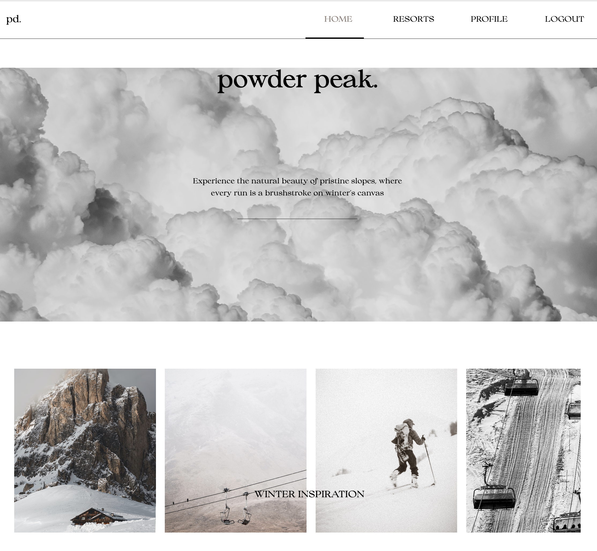
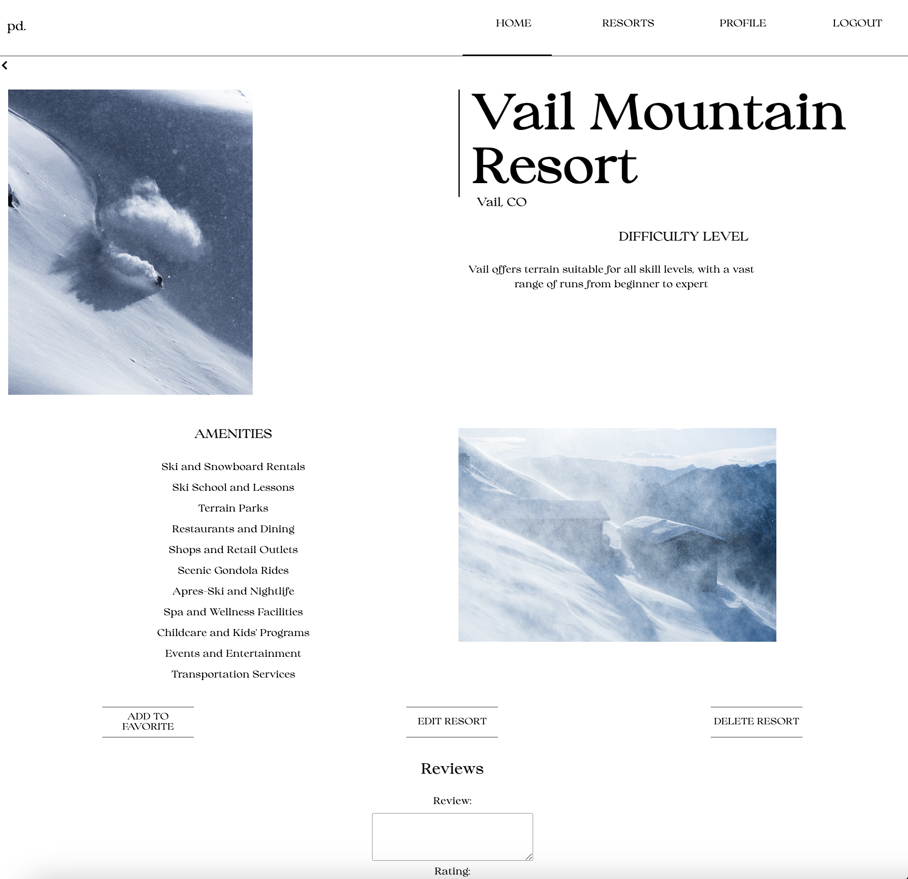

# Powder Peak - Your Gateway to Winter Wonderland
*Powder Peak* is your go-to destination for winter sports enthusiasts. 
With *PP*, you can explore a curated collection of stunning images and articles showcasing the exhilarating beauty of winter landscapes. Dive into a wealth of information about ski and snowboard resorts, each offering a unique blend of challenges and picturesque trails. Start planning your next snow-filled escapade today!

Home Page

Resort Details Page

## How to Navigate
- **Home Page** 
The *Home* Page of Powder Peak welcomes you with a captivating collection of winter-inspired images. Scroll through to immerse yourself in the breathtaking beauty of snow-covered landscapes.

- **All Resorts Page**
Navigate to the *All Resorts* page to explore a curated list of articles featuring various resorts. Discover detailed information about each location, including its amenities, difficulty level, and unique features.

- **Resort Details Page**
For a deeper dive into a specific resort, select it from the list on the *All Resorts* page. Here, you'll find a wealth of information about the resort. Additionally, you can leave a review based on your own experiences or add the resort to your list of favorites.

- **Profile Page**
Visit the *Profile* section to manage your favorite resorts. Here, you can view and modify your list, removing resorts if your preferences change. This page ensures you have easy access to the resorts that matter most to you.

## Features
- **Winter Wonderland Inspiration:** Explore a collection of stunning winter-inspired images.

- **Comprehensive Resort Information:** Access a curated list of articles providing in-depth details about various ski and snowboard resorts.

- **Resort Details and Reviews:** Delve into specific resorts to find comprehensive information. Leave reviews based on your personal experiences.

- **Favorite Resorts List:** Create a personalized list of favorite resorts for quick and easy access. Manage your preferences and remove resorts as needed.

- **User Profiles:** Keep track of your favorite resorts and manage your preferences through your user profile. 

- **Responsive Design:** Enjoy a consistent and user-friendly experience across various devices, including desktops and mobile phones. 

- **Intuitive Navigation:** Effortlessly explore the app's features with a straightforward navigation system, allowing you to find the information you need quickly and easily.

## [Embark on your immersive winter adventure here](https://mz-powder-peak.fly.dev/)
## Technologies Used
- **Frontend:** HTML5, CSS3, and the EJS templating engine
- **Backend:** Node.js and Express.js
- **Database:** MongoDB
- **Authentication:** Google OAuth 
- **Deployment:** Fly.io
- **Version Control:** Git and GitHub

## Credits
- **Images:** [Unsplash](https://unsplash.com/)
- **Font:** [Freepik](https://www.freepik.com/font/collingar)
- **Font:** [Google Fonts](https://fonts.google.com/specimen/Bodoni+Moda?preview.text=Bodoni&preview.text_type=custom&query=Bodoni)

## Ice Box: Future Improvements
- [ ] **Search Functionality**
- [ ] **Filter Resorts by Criteria**
- [ ] **Display Weather Information**
- [ ] **Interactive Maps**
- [x] **Mobile Optimization**

## Author 🏂

Mariia Zhuravleva | [LinkedIn](https://www.linkedin.com/in/mariia-zhuravleva-5232b3219/)
